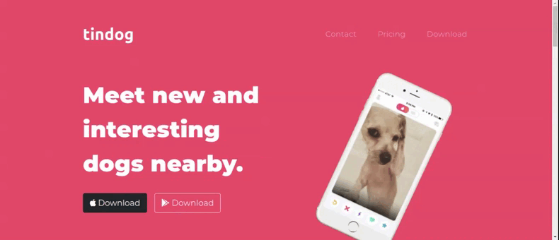

# Tindog

 
 
 

### About Tindog
  A tinder website made for Dogs.
  
### Tools Used
  The main framework used in building the TinDog website is Bootstrap and its components like Carousel, Card, Buttons and Navbar. It also used HTML5, CSS3 and Google Fonts and Font Awesome.
  
Made with :mechanical_arm: :blue_heart: Andressa Flávia

